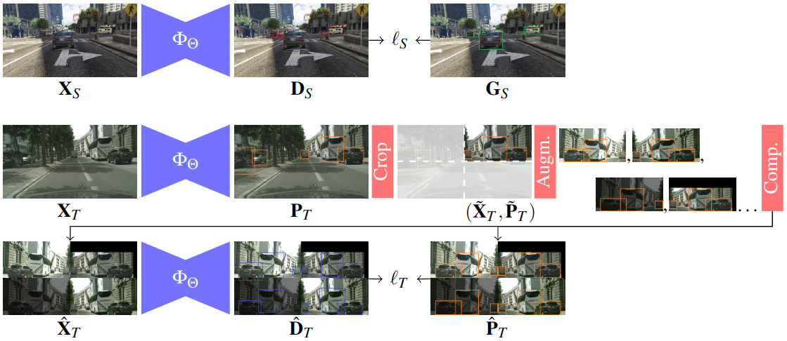

# Detect, Augment, Compose, and Adapt: Four Steps for Unsupervised Domain Adaptation in Object Detection

<p align="center">
  
</p>
<br>

> **Detect, Augment, Compose, and Adapt: Four Steps for Unsupervised Domain Adaptation in Object Detection**<br>
> Mohamed Lamine Mekhalfi, Davide Boscaini, Fabio Poiesi <br>
> **BMVC 2023**

> Paper: [ArXiv](https://arxiv.org/abs/2210.11539) <br>

> **Abstract:** *nsupervised domain adaptation (UDA) plays a crucial role in object detection when adapting a source-trained detector to a target domain without annotated data. In this paper, we propose a novel and effective four-step UDA approach that leverages self- supervision and trains source and target data concurrently. We harness self-supervised learning to mitigate the lack of ground truth in the target domain. Our method consists of the following steps: (1) identify the region with the highest-confidence set of detections in each target image, which serve as our pseudo-labels; (2) crop the identified region and generate a collection of its augmented versions; (3) combine these latter into a com- posite image; (4) adapt the network to the target domain using the composed image. Through extensive experiments under cross-camera, cross-weather, and synthetic-to-real scenarios, our approach achieves state-of-the-art performance, improving upon the near- est competitor by more than 2% in terms of mean Average Precision (mAP). The source code will be made publicly available upon publication.*

# Setup
Clone repo:
```bash
git clone https://github.com/MohamedTEV/DACA.git
```
Navigate to the main directory:
```bash
cd DACA
```

Create environment and install dependencies:
```bash
conda create --name daca python=3.7
conda activate daca
pip install -r requirements.txt  
```
Install pytorch & torchvision (for the right version please visit: https://pytorch.org/):
pip install torch==1.8.0+cu111 torchvision==0.9.0+cu111 torchaudio==0.8.0 -f https://download.pytorch.org/whl/torch_stable.html


# Datasets download & preparation:
The datasets can be downloaded at the following sources. Please note that YOLO format is used for all the datasets.
  - Cityscapes and Foggy Cityscapes datasets can be downloaded at: [link](https://www.cityscapes-dataset.com/downloads/). 
  - Sim10k dataset can be downloaded at: [Sim10k](https://fcav.engin.umich.edu/projects/driving-in-the-matrix).
  - KITTI dataset can be downloaded at: [KITTI](http://www.cvlibs.net/datasets/kitti/eval_object.php?obj_benchmark=2d).


# Training

To reproduce the experimental result, we recommend training the model with the following steps.

Before training, please check `data/Cityscapes2Foggy.yaml`, `data/Sim10K2Cityscapes.yaml`, `data/KITTI2Cityscapes.yaml`, and enter the correct data paths.

The model is trained in 2 successive phases:
- **Phase 1**: Model pre-train
- **Phase 2**: Adaptive learning

## Phase 1: Model pre-train
The first phase of training consists in the pre-training of the model on the source domain. Training can be performed by running the following bash script:

Cityscapes -> Foggy Cityscapes:

```bash
python train.py \
 --name cityscapes \
 --batch 2 \
 --img 600 \
 --epochs 20 \
 --data data/Cityscapes2Foggy.yaml \
 --weights yolov5s.pt
```

Sim10k -> Cityscapes (car category only):

```bash
python train.py \
 --name sim10k \
 --batch 2 \
 --img 600 \
 --epochs 20 \
 --data data/Sim10K2Cityscapes.yaml \
 --weights yolov5s.pt
```

KITTI -> Cityscapes (car category only):

```bash
python train.py \
 --name kitti \
 --batch 2 \
 --img 600 \
 --epochs 20 \
 --data data/KITTI2Cityscapes.yaml \
 --weights yolov5s.pt
```

Qualitative results are saved under the `runs/train/{name}` directory, while checkpoints are saved under the `runs/train/{name}/weights` directory. Please note that in all our experiments we only consider the weights associated with the last training epoch, i.e. `last.pt`.

## Phase 2: Adaptive learning
The second phase of training consists in performing the adaptive learning. Training can be performed by running the following bash script:

Cityscapes -> Foggy Cityscapes:

```bash
python uda_train.py \
 --name cityscapes2foggy \
 --batch 2 \
 --img 600 \
 --epochs 50 \
 --data data/Cityscapes2Foggy.yaml \
 --weights runs/train/cityscapes/weights/last.pt
```

Sim10k -> Cityscapes (car category only):

```bash
python uda_train.py \
 --name sim10k2cityscapes \
 --batch 2 \
 --img 600 \
 --epochs 50 \
 --data data/Sim10K2Cityscapes.yaml \
 --weights runs/train/sim10k/weights/last.pt
```

KITTI -> Cityscapes (car category only):

```bash
python uda_train.py \
 --name kitti2cityscapes \
 --batch 2 \
 --img 600 \
 --epochs 50 \
 --data data/KITTI2Cityscapes.yaml \
 --weights runs/train/kitti/weights/last.pt
```

# Evaluation

The trained models can be evaluated by running the following bash script:

Cityscapes -> Foggy Cityscapes:

```bash
python uda_val.py \
 --name cityscapes2foggy \
 --img 600 \
 --data data/Cityscapes2Foggy.yaml \
 --weights runs/train/cityscapes2foggy/weights/last.pt \
 --iou-thres 0.5
```

Sim10k -> Cityscapes (car category only):

```bash
python uda_val.py \
 --name sim10k2cityscapes \
 --img 600 \
 --data data/Sim10K2Cityscapes.yaml \
 --weights runs/train/sim10k2cityscapes/weights/last.pt \
 --iou-thres 0.5
```

KITTI -> Cityscapes (car category only):

```bash
python uda_val.py \
 --name kitti2cityscapes \
 --img 600 \
 --data data/KITTI2Cityscapes.yaml \
 --weights runs/train/kitti2cityscapes/weights/last.pt \
 --iou-thres 0.5
```

Please note that in all our experiments we only consider the weights associated with the last training epoch, i.e. `last.pt`.

# Citation

Please consider citing our paper in your publications if the project helps your research.
```
@inproceedings{mattolin2023confmix,
  title={ConfMix: Unsupervised Domain Adaptation for Object Detection via Confidence-based Mixing},
  author={Mattolin, Giulio and Zanella, Luca and Ricci, Elisa and Wang, Yiming},
  booktitle={Proceedings of the IEEE/CVF Winter Conference on Applications of Computer Vision},
  pages={423--433},
  year={2023}
}
```

